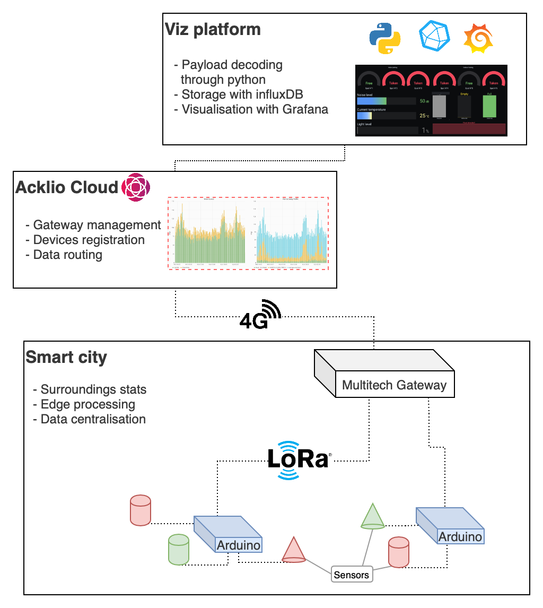

# Develop

This page is the complete doc for the code, infrastructure and all the components related to the demonstrator.


- [Develop](#develop)
- [Infrastructure overview](#infrastructure-overview)
- [Bill Of Materials](#bill-of-materials)
- [Multitech gateway & LNS setup](#multitech-gateway--lns-setup)
  - [Installing the LorIOT daemon](#installing-the-loriot-daemon)
  - [Installing the Acklio daemon](#installing-the-acklio-daemon)
    - [Various things that could go wrong](#various-things-that-could-go-wrong)
      - [Acklio](#acklio)
      - [Mismatched date](#mismatched-date)
  - [Acklio setup](#acklio-setup)
- [Arduinos](#arduinos)
  - [Installation of the code environnement](#installation-of-the-code-environnement)
  - [Configuration adjustements](#configuration-adjustements)
  - [Payload structure of the LoRa frame](#payload-structure-of-the-lora-frame)
  - [Current settings on the demonstrator](#current-settings-on-the-demonstrator)
- [Cloud env](#cloud-env)
  - [Deploy using docker-compose](#deploy-using-docker-compose)
  - [License](#license)


# Infrastructure overview

This is an architectural overview of the smart city demonstrator and its components:




# Bill Of Materials

Here is a list of the hardware components used in the smart city model : 
- 3 [Arduino Uno](https://www.gotronic.fr/art-carte-uno-r3-uno-v3-26125.htm) as micro-controllers, on top of which sits:
  - [Grove Hat](https://www.gotronic.fr/art-module-grove-base-shield-103030000-19068.htm) for easy cable management, with the following sensors : 
    - [Temperature sensor](https://www.gotronic.fr/art-capteur-de-temperature-grove-101020015-18965.htm),
    - [Noise sensor](https://www.gotronic.fr/art-capteur-sonore-grove-101020063-20631.htm),
    - [Light sensor](https://www.gotronic.fr/art-detecteur-de-lumiere-grove-v1-2-101020132-25427.htm),
    - [Hall effect sensors](https://www.gotronic.fr/art-capteur-a-effet-hall-grove-101020046-18985.htm),
    - [Standard LEDs](https://www.gotronic.fr/art-led-8-mm-rgb-variable-grove-101020472-27991.htm),
    - [Chainable LEDs](https://www.gotronic.fr/art-led-8-mm-rgb-grove-v2-0-104020048-27067.htm),
    - [Ultrasonic distance sensors](https://www.gotronic.fr/art-telemetre-a-ultrasons-grove-101020010-18976.htm),
  - A [LoRaWAN antenna](https://www.cooking-hacks.com/lorawan-radio-shield-for-arduino-868-mhz), to upload the gathered data to a nearby gateway,
- A [Multitech LoRa gateaway](https://www.multitech.com/brands/multiconnect-conduit-ap), to receive the payloads from the antenna

# Multitech gateway & LNS setup


The gateway need to be configured beforehand, with a working SIM card (for WAN connectivity), and a SSH access.

The documentation for the gateway can be found here: https://www.multitech.net/developer/software/mlinux/getting-started-with-conduit-mlinux/


The LNS used previously was Acklio. We switched to LorIOT for now.

## Installing the LorIOT daemon

Connect on the gateway through SSH, reset the LoRaWAN settings, then execute the following:

```
wget https://eu5pro.loriot.io/home/gwsw/loriot-multitech-conduit-ap-mcard-SPI-0-latest.sh -O loriot-install.sh
chmod +x loriot-install.sh
./loriot-install.sh -f -s eu5pro.loriot.io
```

## Installing the Acklio daemon

To connect the gateway to the Acklio cloud, we need a special daemon that will forward loRa packets to the Acklio MQTT broker.

First, copy the local `ressources/acklio-semtech-bridge-multitech.ipk` to the gateway using scp.
```
scp ressources/acklio-semtech-bridge-multitech.ipk admin@192.168.2.1
```

then install the following ipk on the gateway:
```
opkg install --force-reinstall acklio-semtech-bridge-multitech.ipk
```


### Various things that could go wrong

The daemon responsible for forwarding the packets to the LNS should start automatically when the gateway boots. 

#### Acklio

if you want to check the logs, you can `/etc/init.d/lora-semtech-bridge stop;/etc/init.d/lora-semtech-bridge start-foreground`. This can be useful when the gateway appears as disconnected from Acklio's side. 
The config is in `/var/config/lora-semtech-bridge/lora-semtech-bridge`, if lines containing mentions of certificates, remove them. The included certificates are out of date.


#### Mismatched date
If you have the following error `Network Error : x509: certificate has expired or is not yet valid` and `date` reports a time that's not correct, it means the gateway's RTC might be off, and NTP might not synchronise to the proper time, you can set the time and save it to the RTC using 

```
date "2022-10-10 10:10:10"
hwclock -u -w
```

## Acklio setup

On Acklio, the following assets are used:
- once the Acklio package has been deployed on the **gateway**, the latter will automatically appear on the `discovered` dashboard. 
- from there, **devices** with the same settings as the real arduinos (dev_eui, dev_addr, app_session_key, network_session_key) can be configured. 
- **Connectors** will allow external services to access the smart city model through various protocols (MQTT(s), HTTP(s)..)
- **Device profiles** will link the devices to the connectors.

# Arduinos 

Each arduino is responsible for a specific task : 
* Arduino 1 is managing the street lamps and monitoring the temperature / noise level of the city,
* Arduino 2 is managing the city's trash cans
* Arduino 3 is managing the parking spots

**Street lamps control**

The street lamps are reacting to a light level sensor, which determines the needed brightness level of the street lamps. 
This enables a better day/night toggling of the street lamps.

**Trash cans monitoring**

The city trash cans are monitored through an ultrasonic sensor, it's fullness status can be reported and the garbage collector system can be adjusted accordingly. 

**Parking management**

Every parking spot can report being taken using a hall effect sensor. This permits a better management of a city's given parking capabilites. 

**City's data gathering**

The city's temperature and noise level are also monitored. This enables long term data analysis, to evaluate long term actions and changes.
A flood detection system is also present, which can alert the surrounding population of an eventual incoming flood.

##  Installation of the code environnement

This project is built on top of various frameworks that simplify the development process :
- [PlatformIO](https://platformio.org) for developing, compiling & deploying the code to the embedded devices,
- [Doxygen](http://www.doxygen.nl/index.html) for automating the documentation building.

Once platformIO is installed ( aka **pip3 install platformio**), you will need just three commands to build the project: 

```
git clone https://code.axians.com/corentin.farque/smartcity
cd SmartCity
platformio run
```

If you also want to build the code documentation yourself, just install doxygen (aka **apt/brew/yum install doxygen**), `cd` in the `SmartCity` directory and run :

```
doxygen
```

You will then have an `doc/` folder. Open the `ìndex.html` file with your browser to access the html doc.

## Configuration adjustements

The same boilerplate file is deployed to every arduino. The logic is the same everywhere, the arduino fetches the sensors and uploads their data to the cloud through an LoRa gateway. The only difference between each Arduino is which sensors are connected and on which pin.  

This is the configuration currently is use in the model in `header.hpp`.
```c
int UltrasonicSensors[] = {2,3,4};
int HallSensors[] = {6,7,8,2,3,5};
int TemperatureSensor = A2;
int SoundSensor = A3;
int BrightnessSensor = A1;
int FloodSensor = 2;
int FloodLED = 3;
int WasteLEDs[] = {6,7,8};
int ParkingLEDS[] = {A2,A3,9,4,A0,A1};
int StreetLampsNumber = 8;
ChainableLED StreetLamps(4,5, StreetLampsNumber);

const int RUNTIME_INTERVAL = 1000;   //! time in ms between runs
```

The LoRa configuration is in `lora.hpp` :
```c
static char DEVICE_EUI[] = "0102030405060715";
static char DEVICE_ADDR[] = "06060715"; 
static char NWK_SESSION_KEY[] = "01020304050607080910111213141516"; 
static char APP_SESSION_KEY[] = "000102030405060708090A0B0C0D0E0F"; 
```

Therefore, you must adapt the `header.hpp` , in order to reflects:
-  which scenarios are being used by this arduino (using the `#DEFINE` statements)
-  which sensors are connected to the arduino and their positions on the Grove Hat.

##  Payload structure of the LoRa frame

Each arduino has it's own various data to send, so each payload is different :

**Garbage scenario**

| Byte number | 0 | 1 | 2 | 3 | 4 |
|-------------|-------|---------|--------------|---------|---------|
| Desc | Trash 1 | Null | Trash 2 | Null | Trash 3 |
| Value | 1 | 0 | 1 | 0 | 1 |

Explanations : 
- Trash : 1 means the trashcan is full, 0 means it's not.

**Parking scenario**

| Byte number | 0 | 1 | 2 | 3 | 4 | 5 | 6 | 7 | 8 | 9 | 10 |
|-------------|-------|---------|--------------|---------|---------|---------|---------|-----------|-----------|--|--|
| Desc | Parking 1 | Null | Parking 2 | Null | Parking 3 | Null | Parking 4 | Null | Parking 5 |  Null | Parking 6|
| Value | 1 | 0 | 1 | 0 | 0 | 0 | 1 | 0 | 0 | 0 | 1 |

Explanations : 
 - Parking : 1 means the parking spot is taken, 0 means it's free.

**Street lamps & metrics scenario**

| Byte number | 0 | 1 | 2 | 3 | 4 | 5 | 6 | 7 | 8 | 9 | 10 | 11 | 12 | 13 | 14 | 15 |
|-------------|-------|---------|--------------|---------|---------|---------|---------|-----------|-----------|--|--|--|---|---|---|---|
| Desc | Lights status | Null | Null | Flood status | Null | Null | Null | Null | Null |  Null | Light level | Light level | Noise | Noise | Temp | Temp | 
| Value | 1 | 0 | 0 | 1 | 0 | 0 | 0 | 0 | 0 | 0 | 8 | 9 | 4 | 8 | 2 | 5 | 

Explanations : 
- Lights status : 1 means the lights are on, 0 means off.
- Flood status : 1 means flood detected, 0 means no flood detected
- Light level : Bytes 10 and 11 are forming a numnber reflecting the percentage of light perceived by the sensor, here 89%. 
- Noise : Bytes 12 and 13 are the current noise level reading in decibels. Here is 48 dB.
- Temp : Bytes 14 and 15, the current temperature reading in Celsius, here 25°C.

## Current settings on the demonstrator

parking:
- deveui 0102030405060721
- parking hall sensors on PINs {6, 7, 8, 2, 3, 5}
- parking leds on PINs {A2, A3, 9, 4, A0, A1}


trash cans
- deveui 0102030405060723
- ultrasonic sensors on PINs {2, 3, 4}
- LEDs on pins  {6, 7, 8}


temp/sound
- deveui 0102030405060720
- Temperature sensor on pin A2
- Sound sensor on pin A3
- Brightness sensor on pin A1
- Flood sensor on pin 2
- Flood LED on pin 3

# Cloud env

A preconfigured environment for visualizing & storing the data is available in the `cloud-platform` folder.

It contains a docker-compose based stack that uses InfluxDB (for storing data), Grafana (for visualizing) and a python connector for retrieving the data from a MQTT broker.

## Deploy using docker-compose

Set up the docker-compose file with the required variables. They should be configured according to the mqtts connector from the LNS server:
```
  worker:
  ...
      - MQTT_ENDPOINT=
      - MQTT_PORT=
      - MQTT_USER=
      - MQTT_PASS=
      - MQTT_TOPIC=
```
 
Then, add your tls cert & key as `tls.crt` and `tls.key`, or create self-signed ones like so :
```
openssl req -x509 -nodes -newkey rsa:2048 -keyout tls.key -out tls.crt -days 365
```

Then, just `docker-compose up -d`. Grafana will be available at __https://host:3000__.


## License

2019-2022, k0rventen

The LoRa library is GPL, as is whatever code calling it, including the `/src` dir.
But my lib for the sensors in `/lib/sensors` is under MIT.
Same goes for the code of the python worker, all MIT.
