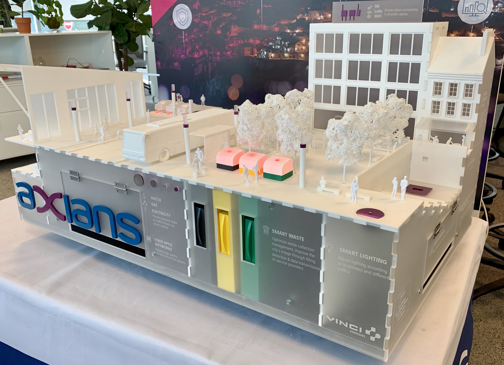
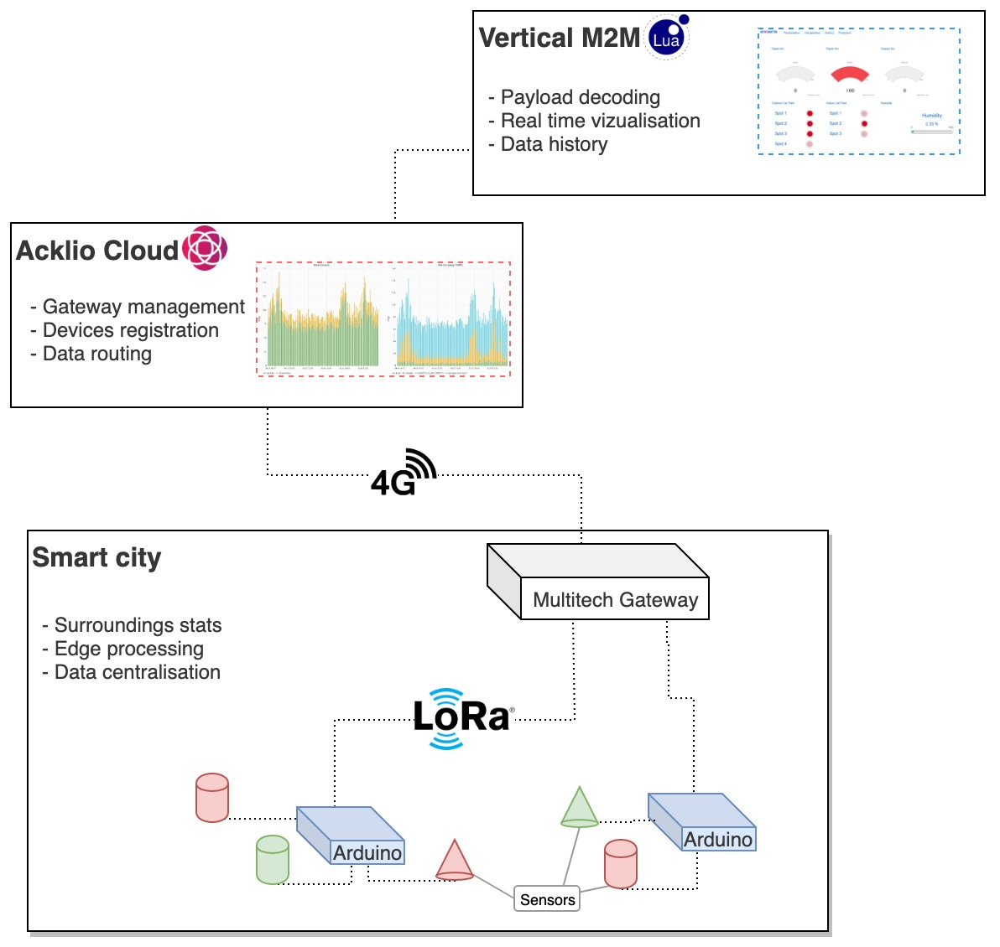
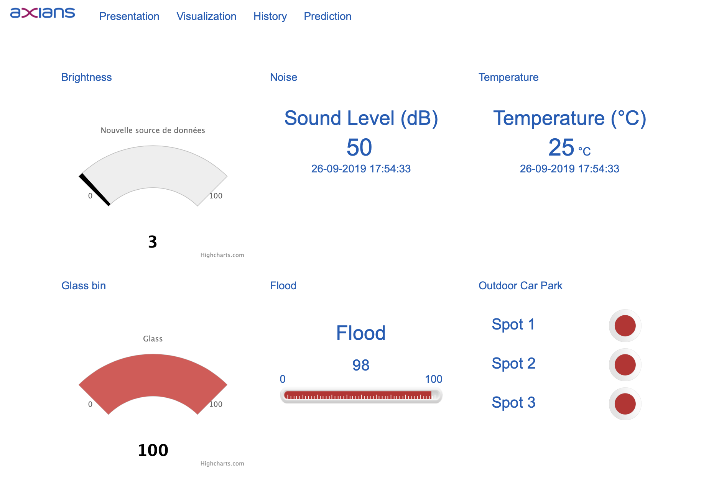

# Smart city

What a smart city could be like, integrating IoT sensors and scenarios to further enhance the convenience of the city's services for the inhabitants, while improving its energetic efficiency. 

CI : 



- [Smart city](#smart-city)
  - [Introduction](#introduction)
  - [Smart scenarios](#smart-scenarios)
  - [Components overview](#components-overview)
  - [Physical scale model](#physical-scale-model)
    - [Hardware listing](#hardware-listing)
    - [Installation of the code environnement](#installation-of-the-code-environnement)
    - [Configuration adjustements](#configuration-adjustements)
    - [Payload structure of the LoRa frame](#payload-structure-of-the-lora-frame)
  - [Acklio Cloud](#acklio-cloud)
    - [Gateway](#gateway)
    - [Devices](#devices)
    - [Connectors](#connectors)
    - [Device profiles](#device-profiles)
  - [M2M Interface](#m2m-interface)
    - [Categories](#categories)
    - [Frame decoding](#frame-decoding)
    - [Interface logic](#interface-logic)
  - [License](#license)


## Introduction

This is the repo for everything regarding the Axians's smart city model.

## Smart scenarios 

This smart city model is prepared to react to 4 scenarios : 

**Street lamps control**

The street lamps are reacting to a light level sensor, which determines the needed brightness level of the street lamps. 
This enables a better day/night toggling of the street lamps.

**Trash cans monitoring**

The city trash cans are monitored through an ultrasonic sensor, it's fullness status can be reported and the garbage collector system can be adjusted accordingly. 

**Parking management**

Every parking spot can report being taken using a hall effect sensor. This permits a better management of a city's given parking capabilites. 

**City's data gathering**

The city's temperature and noise level are also monitored. This enables long term data analysis, to evaluate long term actions and changes.
A flood detection system is also present, which can alert the surrounding population of an eventual incoming flood.


## Components overview 

Here is a quick diagramm showing every major component of the model : 




Each section below is describing one of those components.

## Physical scale model

### Hardware listing

Here is a list of the hardware components used in the smart city model : 
- 3 [Arduino Uno](https://www.gotronic.fr/art-carte-uno-r3-uno-v3-26125.htm) as micro-controllers, on top of which sits:
  - [Grove Hat](https://www.gotronic.fr/art-module-grove-base-shield-103030000-19068.htm) for easy cable management, with the following sensors : 
    - [Temperature sensor](https://www.gotronic.fr/art-capteur-de-temperature-grove-101020015-18965.htm),
    - [Noise sensor](https://www.gotronic.fr/art-capteur-sonore-grove-101020063-20631.htm),
    - [Light sensor](https://www.gotronic.fr/art-detecteur-de-lumiere-grove-v1-2-101020132-25427.htm),
    - [Hall effect sensors](https://www.gotronic.fr/art-capteur-a-effet-hall-grove-101020046-18985.htm),
    - [Standard LEDs](https://www.gotronic.fr/art-led-8-mm-rgb-variable-grove-101020472-27991.htm),
    - [Chainable LEDs](https://www.gotronic.fr/art-led-8-mm-rgb-grove-v2-0-104020048-27067.htm),
    - [Ultrasonic distance sensors](https://www.gotronic.fr/art-telemetre-a-ultrasons-grove-101020010-18976.htm),
  - A [LoRaWAN antenna](https://www.cooking-hacks.com/lorawan-radio-shield-for-arduino-868-mhz), to upload the gathered data to a nearby gateway,
- A [Multitech LoRa gateaway](https://www.multitech.com/brands/multiconnect-conduit-ap), to receive the payloads from the antenna


Each arduino is responsible for a specific task : 
* Arduino 1 is managing the street lamps and monitoring the temperature and noise level of the city,
* Arduino 2 is managing the city's trash cans
* Arduino 3 is managing the parking spots


### Installation of the code environnement

This project is built on top of various frameworks that simplify the development process :
- [PlatformIO](https://platformio.org) for developing, compiling & deploying the code to the embedded devices,
- [Doxygen](http://www.doxygen.nl/index.html) for automating the documentation building.

Once platformIO is installed ( aka **pip3 install platformio**), you will need just three commands to build the project: 

```
git clone https://code.axians.com/corentin.farque/smartcity
cd SmartCity
platformio run
```

If you also want to build the code documentation yourself, just install doxygen (aka **apt/brew/yum install doxygen**), `cd` in the `SmartCity` directory and run :

```
doxygen
```

You will then have an `doc/` folder. Open the `ìndex.html` file with your browser to access the html doc.

### Configuration adjustements

The same boilerplate file is deployed to every arduino. The logic is the same everywhere, the arduino fetches the sensors and uploads their data to the cloud through an LoRa gateway. The only difference between each Arduino is which sensors are connected and on which pin.  

This is the configuration currently is use in the model in `header.hpp`.
```c
int UltrasonicSensors[] = {2,3,4};
int HallSensors[] = {6,7,8,2,3,5};
int TemperatureSensor = A2;
int SoundSensor = A3;
int BrightnessSensor = A1;
int FloodSensor = 2;
int FloodLED = 3;
int WasteLEDs[] = {6,7,8};
int ParkingLEDS[] = {A2,A3,9,4,A0,A1};
int StreetLampsNumber = 8;
ChainableLED StreetLamps(4,5, StreetLampsNumber);

const int RUNTIME_INTERVAL = 1000;   //! time in ms between runs
```

The LoRa configuration is in `lora.hpp` :
```c
static char DEVICE_EUI[] = "0102030405060715";
static char DEVICE_ADDR[] = "06060715"; 
static char NWK_SESSION_KEY[] = "01020304050607080910111213141516"; 
static char APP_SESSION_KEY[] = "000102030405060708090A0B0C0D0E0F"; 
```

Therefore, you must adapt the `header.hpp` , in order to reflects:
-  which scenarios are being used by this arduino (using the `#DEFINE` statements)
-  which sensors are connected to the arduino and their positions on the Grove Hat.

### Payload structure of the LoRa frame

Each arduino has it's own various data to send, so each payload is different :

**Garbage scenario**

| Byte number | 0 | 1 | 2 | 3 | 4 |
|-------------|-------|---------|--------------|---------|---------|
| Desc | Trash 1 | Null | Trash 2 | Null | Trash 3 |
| Value | 1 | 0 | 1 | 0 | 1 |

Explanations : 
- Trash : 1 means the trashcan is full, 0 means it's not.

**Parking scenario**

| Byte number | 0 | 1 | 2 | 3 | 4 | 5 | 6 | 7 | 8 | 9 | 10 |
|-------------|-------|---------|--------------|---------|---------|---------|---------|-----------|-----------|--|--|
| Desc | Parking 1 | Null | Parking 2 | Null | Parking 3 | Null | Parking 4 | Null | Parking 5 |  Null | Parking 6|
| Value | 1 | 0 | 1 | 0 | 0 | 0 | 1 | 0 | 0 | 0 | 1 |

Explanations : 
 - Parking : 1 means the parking spot is taken, 0 means it's free.

**Street lamps & metrics scenario**

| Byte number | 0 | 1 | 2 | 3 | 4 | 5 | 6 | 7 | 8 | 9 | 10 | 11 | 12 | 13 | 14 | 15 |
|-------------|-------|---------|--------------|---------|---------|---------|---------|-----------|-----------|--|--|--|---|---|---|---|
| Desc | Lights status | Null | Null | Flood status | Null | Null | Null | Null | Null |  Null | Light level | Light level | Noise | Noise | Temp | Temp | 
| Value | 1 | 0 | 0 | 1 | 0 | 0 | 0 | 0 | 0 | 0 | 8 | 9 | 4 | 8 | 2 | 5 | 

Explanations : 
- Lights status : 1 means the lights are on, 0 means off.
- Flood status : 1 means flood detected, 0 means no flood detected
- Light level : Bytes 10 and 11 are forming a numnber reflecting the percentage of light perceived by the sensor, here 89%. 
- Noise : Bytes 12 and 13 are the current noise level reading in decibels. Here is 48 dB.
- Temp : Bytes 14 and 15, the current temperature reading in Celsius, here 25°C.


## Acklio Cloud

To manage our devices (gateway, sensors..) and enable 3rd party apps to access our data, we are using Acklio's cloud. 


### Gateway

Once the Acklio package has been deployed on the **gateway**, it will automatically appear on the `discovered` dashboard. 

### Devices

From there, **devices** with the same settings as the real arduinos (dev_eui, dev_addr, app_session_key, network_session_key) can be configured. 

### Connectors

**Connectors** will allow external services to access the smart city model through various protocols (MQTT, HTTP..)

### Device profiles

Then, **device profiles** will link the devices to the connectors.


## M2M Interface



### Categories

To display in a fancier manner our data, we are using Vertical M2M. From our M2M instance, we'll connect to the Acklio cloud using a **HTTP callback connector** from Acklio : 

Each Arduino get its own **category**, in which we define the kind of device, the transmission type, and the code needed to decode the payloads. 

### Frame decoding

The following  code is used to decode the payload and retrieve the data from it (yes it's Lua, yes they we are in 2019, whatev) :

**This is for the Street lamps and metrics arduino :**
```lua
local payload = bin2hex(getInputPayload())

local flood_status = tonumber(string.sub(payload,4,4),10)
if flood_status == 1 then
	flood_status = 0
elseif flood_status == 0 then
	flood_status = 1
end
	setOutputRecordData(90,flood_status)

local light_status = tonumber(string.sub(payload,1,1),10)
setOutputRecordData(91,flood_status)

local light_level = tonumber(string.sub(payload,11,12),10)
setOutputRecordData(92,light_level)
	
local temp = tonumber(string.sub(payload,15,16),10)
setOutputRecordData(5,temp)


local son = tonumber(string.sub(payload,13,14),10)
setOutputRecordData(93,son)
```

**This is for the Garbage monitoring**
```lua
local payload = bin2hex(getInputPayload())


local trash1 = tonumber(string.sub(payload,1,1),10)
if trash1 > 0 then
	trash1 = 100
end

setOutputRecordData(90,trash1)

local trash2 = tonumber(string.sub(payload,3,3),10)
if trash2 > 0 then
	trash2 = 100
end
setOutputRecordData(91,trash2)

local trash3 = tonumber(string.sub(payload,5,5),10)
if trash3 > 0 then
	trash3 = 100
end
setOutputRecordData(92,trash3)
```


**This is for the parking spot management:**
```lua
local payload = bin2hex(getInputPayload())


local parking_spot1 = tonumber(string.sub(payload,1,1),10)
setOutputRecordData(90,parking_spot1)


local parking_spot2 = tonumber(string.sub(payload,3,3),10)
setOutputRecordData(91,parking_spot2)


local parking_spot3 = tonumber(string.sub(payload,5,5),10)
setOutputRecordData(92,parking_spot3)


local parking_spot4 = tonumber(string.sub(payload,7,7),10)
setOutputRecordData(93,parking_spot4)


local parking_spot5 = tonumber(string.sub(payload,9,9),10)
setOutputRecordData(94,parking_spot5)


local parking_spot6 = tonumber(string.sub(payload,11,11),10)
setOutputRecordData(95,parking_spot6)
```


### Interface logic

This is just a drag n drop system, where you place widgets on the dashboard, and connect the rights data sources to it.

## License

2019, k0rventen

The LoRa library is GPL, therefore is whatever code calling it, including the `/src` dir.
But my lib for the sensors in `/lib/sensors` is under MIT.

It's open source.
Use it. Tweak it. Improve on it. Share it.