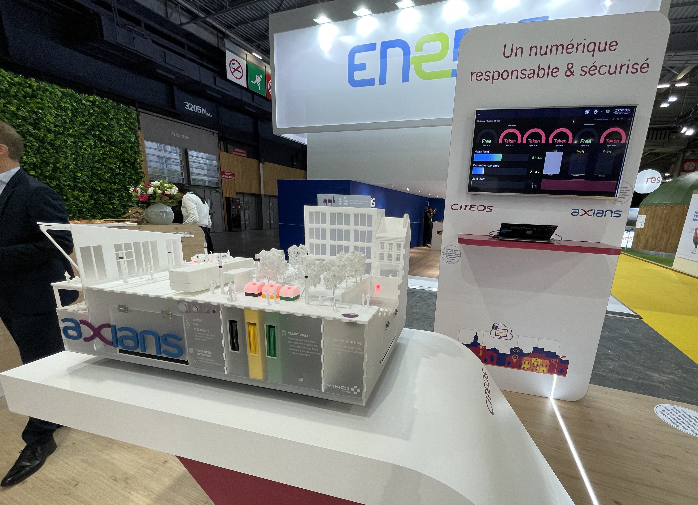
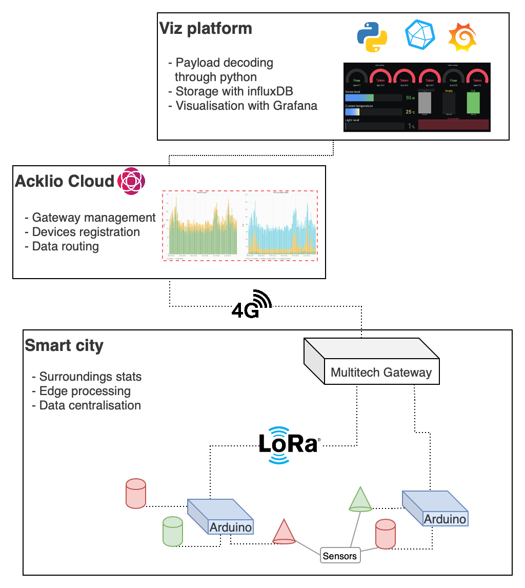
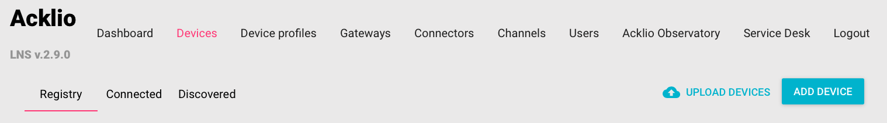
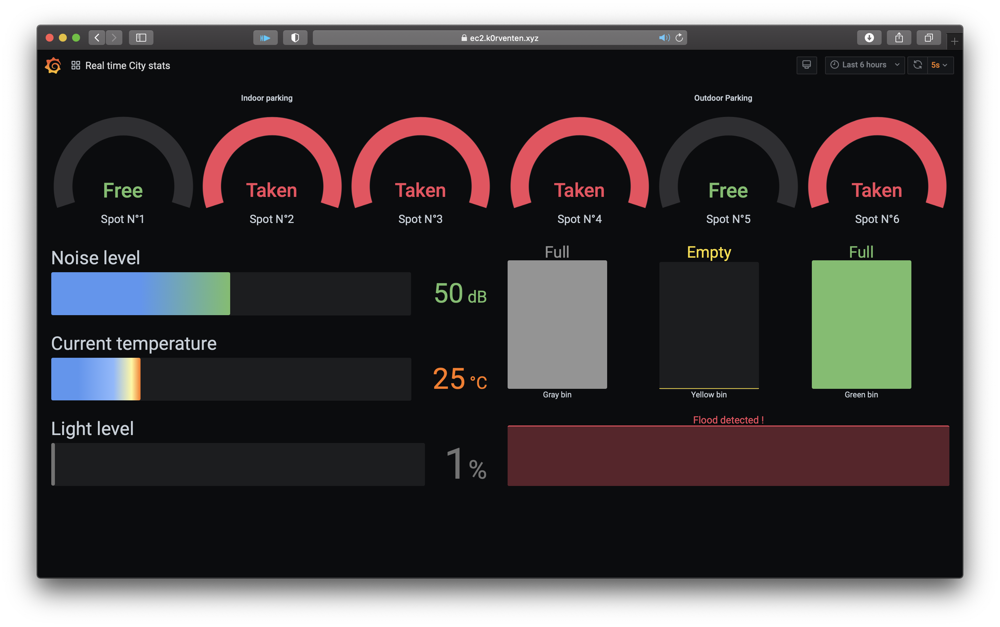
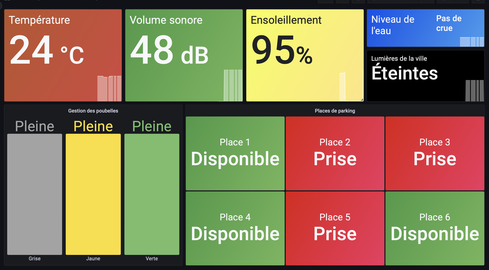

# Smart city

What a smart city could be like, integrating IoT sensors and scenarios to further enhance the convenience of the city's services for the inhabitants, while improving its energetic efficiency. 

- [Smart city](#smart-city)
  - [Introduction](#introduction)
  - [Components overview](#components-overview)
    - [Hardware listing](#hardware-listing)
  - [Acklio Cloud](#acklio-cloud)
  - [Cloud platform](#cloud-platform)
  - [More infos](#more-infos)
  - [License](#license)

## Introduction

This is the repo for everything regarding the Axians's smart city model.

## Components overview 

Here is a quick diagram showing every major component of the model : 

- Various sensors (temperature, humidity, noise, parking spots..) are connected to Arduinos equipped with LoRa antennas, that transmits to a nearby 4G LoRa gateway.
- Data & management informations are uploaded to our Acklio server.
- Actual sensor data is retrieved by an AWS instance for decoding/storage/visualisation.

Each section below is describing one of those components.

### Hardware listing

Here is a list of the hardware components used in the smart city model : 
- 3 [Arduino Uno](https://www.gotronic.fr/art-carte-uno-r3-uno-v3-26125.htm) as micro-controllers, on top of which sits:
  - [Grove Hat](https://www.gotronic.fr/art-module-grove-base-shield-103030000-19068.htm) for easy cable management, with the following sensors : 
    - [Temperature sensor](https://www.gotronic.fr/art-capteur-de-temperature-grove-101020015-18965.htm),
    - [Noise sensor](https://www.gotronic.fr/art-capteur-sonore-grove-101020063-20631.htm),
    - [Light sensor](https://www.gotronic.fr/art-detecteur-de-lumiere-grove-v1-2-101020132-25427.htm),
    - [Hall effect sensors](https://www.gotronic.fr/art-capteur-a-effet-hall-grove-101020046-18985.htm),
    - [Standard LEDs](https://www.gotronic.fr/art-led-8-mm-rgb-variable-grove-101020472-27991.htm),
    - [Chainable LEDs](https://www.gotronic.fr/art-led-8-mm-rgb-grove-v2-0-104020048-27067.htm),
    - [Ultrasonic distance sensors](https://www.gotronic.fr/art-telemetre-a-ultrasons-grove-101020010-18976.htm),
  - A [LoRaWAN antenna](https://www.cooking-hacks.com/lorawan-radio-shield-for-arduino-868-mhz), to upload the gathered data to a nearby gateway,
- A [Multitech LoRa gateaway](https://www.multitech.com/brands/multiconnect-conduit-ap), to receive the payloads from the antenna

Each arduino is responsible for a specific task : 
* Arduino 1 is managing the street lamps and monitoring the temperature / noise level of the city,
* Arduino 2 is managing the city's trash cans
* Arduino 3 is managing the parking spots

## Acklio Cloud

To manage our devices (gateway, sensors..) and enable 3rd party apps to access our data, we are using Acklio's cloud. 

## Cloud platform

A cloud-based visualisation platform is being used. Running anywhere is a influxDB + Grafana combo for long-term storage & visualisation. 

Example of dashboards

it is composed of :
- a python worker that connects to Acklio, decode the payload and stores it into influxDB
- influxDB, a timeseries database for storing the data uploaded by the smart city
- grafana, to visualize the data either in "real" time, or historically. 

## More infos

The code, infrastructure & other components docs are documented in `DEVELOP.md`.

## License

2019-2022, k0rventen

The LoRa library is GPL, as is whatever code calling it, including the `/src` dir.
But my lib for the sensors in `/lib/sensors` is under MIT.
Same goes for the code of the python worker, all MIT.
