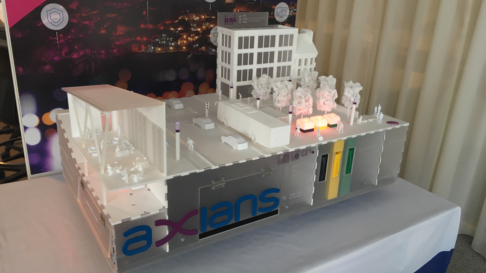

# Smart city

CI : 



What a smart city could be like, integrating IoT sensors and scenarios to further enhance the convenience of the city's services for the inhabitants, while improving its energetic efficiency.

This document describes the context, purpose and a quick overview of the smart city mockup project, specifically from a programming point of view.

- [Smart city](#smart-city)
  - [Purpose](#purpose)
  - [Hardware used](#hardware-used)
  - [Smart scenarios](#smart-scenarios)
  - [How to install](#how-to-install)
  - [How to configure](#how-to-configure)
  - [Technical deepdive & interesting bits](#technical-deepdive--interesting-bits)
    - [Payload structure](#payload-structure)
      - [TL;DR](#tldr)
      - [Explanations](#explanations)
      - [Garbage scenario](#garbage-scenario)
      - [Parking scenario](#parking-scenario)
      - [Street lamps scenario](#street-lamps-scenario)
      - [Metrics scenario](#metrics-scenario)
    - [Debugging memory overflow & stack crashes](#debugging-memory-overflow--stack-crashes)
    - [LoraWAN Stack](#lorawan-stack)
  - [License](#license)


## Purpose

This smart city mockup is a 3D printed / laser cutted model of a city, designed to better explains what is a smart city, how IoT is integrated in it, and how its impacting the city.

## Hardware used

Here is a list of each component : 
- Arduino Uno as the micro-controller, on top of which sits:
  - Grove Hat for easy cable management, with the following sensors : 
    - Temperature sensor,
    - Noise sensor,
    - Light sensor,
    - Hall effect sensors,
    - Various LEDs,
    - Ultrasonic distance sensors,
  - A LoRaWAN antenna, to upload the gathered data to a nearby gateway

## Smart scenarios

Each Arduino is connected to a subset of the aforementionned sensors, creating some scenarios that a future, smart city could integrate : 

**Street lamps control**

The street lamps are reacting to a light level sensor, which determines the needed brightness level of the street lamps. 
This enables a better day/night toggling of the street lamps.

**Trash cans monitoring**

The city trash cans are monitored through an ultrasonic sensor, it's fullness status can be reported and the garbage collector system can be adjusted accordingly. 

**Parking management**

Every parking spot can report being taken using a hall effect sensor. This permit a better management of a city's given parking capabilites. 

**City's data gathering**

The city's temperature and noise level are also monitored. This enables long term data analysis, to evaluate long term actions and changes.
A flood detection system is also present, which can alert the surrounding population of an eventual incoming flood.

## How to install

This project is built on top of various frameworks that simplify the development process :
- [PlatformIO](https://platformio.org) for developing, compiling & deploying the code to the embedded devices,
- [Doxygen](http://www.doxygen.nl/index.html) for automating the documentation building.

Once platformIO is installed ( aka **pip install platformio**), you will need just three commands to build the project: 

```
git clone https://code.axians.com/corentin.farque/smartcity
cd SmartCity
platformio run
```

If you also want to build the documentation yourself, just install doxygen (aka **apt install doxygen**), `cd` in the `SmartCity` directory and run :

```
doxygen
```

You will then have an `doc/` folder. Open the `ìndex.html` file with your browser to access the html doc.

## How to configure

The same boilerplate file is deployed to every arduino. The logic is the same everywhere, the arduino fetches the sensors and uploads their data to the cloud through an LoRa gateway. The only difference between each Arduino is which sensors are connected and on which pin. 

Therefore, you must adapt the `header.hpp` to reflects the sensors connected to the arduino and their positions on the Grove Hat.

Here is an example `header.hpp`, configured with both Street Lamps control and parking monitoring.

```c
#define STREETLAMPSCENARIO
//#define WASTESCENARIO
//#define CITYMETRICSCENARIO
#define PARKINGSCENARIO
```

You must also report the correct pin layout, such as :

```c
int UltrasonicSensors[] = {2};
int HallSensors[] = {6};
int TemperatureSensor = A0;
int SoundSensor = A3;
int BrightnessSensor = A2;
int FloodSensor = A3;
int WasteLEDs[] = {5};
int ParkingLEDS[] = {A1};
int NumberOfStreetLamps = 8;
ChainableLED StreetLamps(8, 9, NumberOfStreetLamps);
```

As a sidenote, 
```c
#define DEBUG
```
will make a more verbose output, usefull during testing. You can comment it when pushing the code for production use.


## Technical deepdive & interesting bits

### Payload structure

#### TL;DR
| Byte number | 0 | 1 | 2 | 3 | 4 | 5 | 6 | 7 | 8 | 9 | 10 | 11 | 12 | 13 | 14 | 15 | 16 | 17 | 18 |
|-------------|-------|---------|--------------|---------|---------|---------|---------|-----------|-----------|-----------|-----------|-----------|-----------|--------------|-------------|-------------|-------|-------|-------|
| Desc | Waste | Parking | Street Lamps | Metrics | Trash 1 | Trash 2 | Trash 3 | Parking 1 | Parking 2 | Parking 3 | Parking 4 | Parking 5 | Parking 6 | Street Lamps | Temperature | Temperature | Noise | Noise | Flood |
| Value | 0 | 1 | 0 | 1 | 0 | 0 | 1 | 1 | 0 | 0 | 1 | 0 | 0 | 0 | 2 | 5 | 4 | 6 | 0 |

This translates to : Parking and metrics scenarios are enabled, trash can 3 is filled up, parking spots 1 and 4 are in use, it's 25°C out there, its currently pretty quiet at 46 dB and there is no flood detected.

#### Explanations

The payload is using a very simple structure, whithout any base64 or hex encoding as it's quite unecessary.

The payload is structured as follows :

The first 4 bytes are configuring which scenarios are enabled. 0 means disabled, 1 means enabled.

The order is as follows : waste, parking, street lamps,metrics. `0101` means for example that both parking and metrics are enabled. 


The following bytes contains the actual data. As each scenario upload various type of data (integers, booleans etc), the payload follows this guide : 

#### Garbage scenario

the waste scenario is taking up 3 bytes. Each byte represents a trash can, and the value corresponds to the trash can fullness. 1 means the trash can is full, 0 means otherwise.

#### Parking scenario

In a smimilar fashion as the waste scenario, the parking scenario is using 6 bytes, 1 for each parking spot. A 1 means the spot is taken, 0 means free.


#### Street lamps scenario 

The street lamp scenario is using only one byte. For now we only upload a day/night status, as the brightness value is arbitrary and does not accurately represents a Lux ou lumen value.

#### Metrics scenario

The metrics scenario is taking up 5 bytes. The scenario is gathering a volume (dB), temperature (°C) and flood metric. The two first are integers, and the lqst one is a simple 0/1.


The rest of the bytes can be filled with whatever, we don't look them up.

### Debugging memory overflow & stack crashes

If sometimes unexpected things are happening after a while, it may be time to check the memory pressure evolution of the programm. Here is a quick function that returns the interval between the stack and the heap. 

```c
extern char *__brkval;
int freeMemory()
{
    char top;
    return &top - __brkval;
}
```

Just add `Serial.println(freeMemory());` in your loop. If this gradually decreases towards 0, you have a memory leakage somewhere and stuff will break at some point. Dunno when, but it will.

### LoraWAN Stack

The antennas we are using for transmitting data wirelessly is through LoRaWANs antennas. Unfortunately, they are not the 
most efficient for the task (they are way too big and powerful for this use case), and their software has some bugs :

- The library is outputing debug info through the Serial object, but it's not initialized by default and it has to be at a 57600 baudrate. This means you'll need a `Serial.begin(57600);` in your code if you want to output stuff to the console.
- If the main code is calling the Serial object while the lora lib is also using it (although you don't know when it will), it may crash, aka reset the arduino. 
- The lib is very heavy, using about 80% of an Arduino Uno R3's flash memory. That's not cool.

Alternatives that should be investigated in the future, are HopeRF 95 modules, on top of which you could run [LMIC](https://github.com/matthijskooijman/arduino-lmic).

## License

2019, k0rventen

The LoRa library is GPL, therefore is whatever code calling it, including the `/src` dir.
But my lib for the sensors in `/lib/sensors` is under MIT.

It's open source.
Use it. Tweak it. Improve on it. Share it.